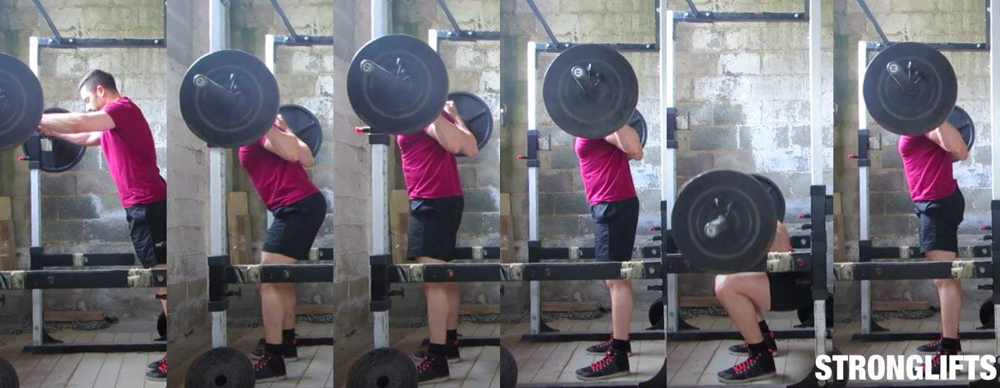

# Learn-How-to-Squat
# Introduction:
Squatting is an excercise that strengthens your thighs and glutes. It also builds core strength. Squatting can be a fun and safe excercise when done correctly. It's easy to learn! Make sure you have the following materials:
* a bar 
* a squatting rack 
* weights 
* shoes  

# Theory:
People squat in many different ways. This is a uniform approach that suits beginners and experienced weightlifters. 

# WARNING:
**Squatting incorrectly can result in serious injury**. Never attempt squatting weight you are uncomfortable with. It is strongly advised to start light and build up to your comfort level. Ask a friend to spot you if you're nervous! 

# Steps:
**1. Put on lifting shoes.** 
* To avoid ankle instability, wear rigid shoes with little padding.
* Vans are a good lifting shoe. 
***
**2. Load weight equally onto each side of the bar and fasten with clips.**
* Once again, only lift weight you are comfortable with. 
***
**3. Place your hands on the bar a shoulders-width apart.**
***
**4. Position yourself under the bar so that it rests on the ridge of your shoulder blades below your neck.** 
* Never rest the bar on your neck. 
***
**5. Extend your legs and lift the bar up off the rack.**
***
**6. Take a half-step back.**
***
**7. Push your butt back and bend slowly at the hips.**
* Keep your back at a 45 degree angle. 
***
**8. Keep your knees parallel to your feet.**
* Support your weight in your heels and not the balls of your feet.

***
**9. Once your hips are below your knees, push off the ground.**
***
**10. Return to the upright position and repeat as many times as necessary.** 
***

 
# Conclusion:
And there you have it! You're a certified weightlifter. After your intense workout, take a break and get some water. Remember to stay safe and have fun in the iron playground! 

